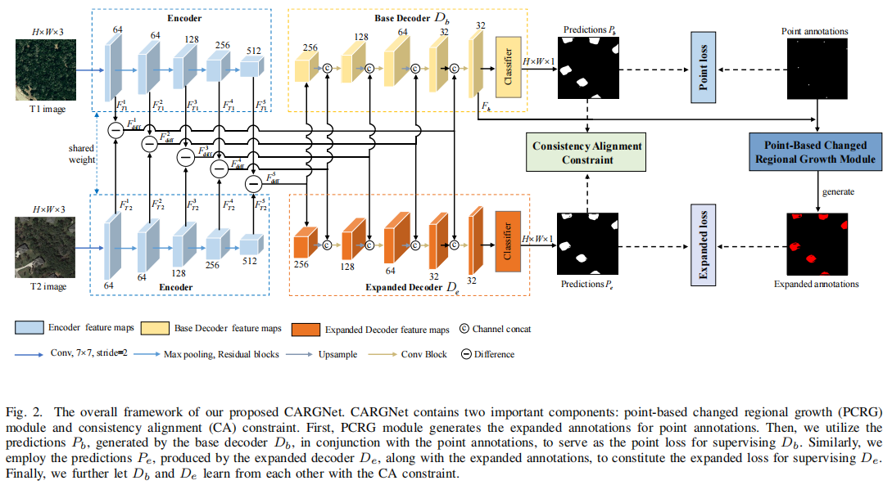

# CARGNet
Code for TGRS 2023 paper, "Point Label Meets Remote Sensing Change Detection: A Consistency-Aligned Regional Growth Network".

Authors: [Leyuan Fang](https://scholar.google.com/citations?hl=en&user=Gfa4nasAAAAJ), Yiqi Jiang, Hongfeng Yu, Yingying Zhang, and [Jun Yue](https://scholar.google.com.hk/citations?hl=zh-CN&user=epXQ1RwAAAAJ)
## 📖Overall Framework

## 📖Requirements
```
- python 3.8
- pytorch 1.7.1
- opencv-python 4.8.1.78
- torchvision 0.8.2
- pillow 9.0.1
- tqdm 4.63.0
```
## 📖Dataset Preparation
### 📔Dataset Structure
* `LEVIR-CD-Point`:
    * `train`:
      * `C`：Changed images.
      * `UC`：Unchanged images.
    * `test`:
      * `image`
      * `image2`
      * `label`
* `DSIFN-CD-Point`:
    * `train`:
      * `C`：Changed images.
      * `UC`：Unchanged images.
    * `test`:
      * `image`
      * `image2`
      * `label`
### 📔Data Download
The LEVIR-CD-Point dataset can be downloaded from: [here](https://pan.baidu.com/s/1bV1TCNxbloJveqh1eG3a7w?pwd=dskl) 

The DSIFN-CD-Point dataset can be downloaded from: [here](https://pan.baidu.com/s/12wkHXxStmlrgcNk3yMdqyA?pwd=dlst) 
## 📖Evaluate
### 1. Download our [weights](https://pan.baidu.com/s/1RkEPaV-hGVjVn0eSQ3Dbqw?pwd=xthc)
### 2. Run our code
```
python test.py
```
## 📖Train our network 
```
python train.py
```
